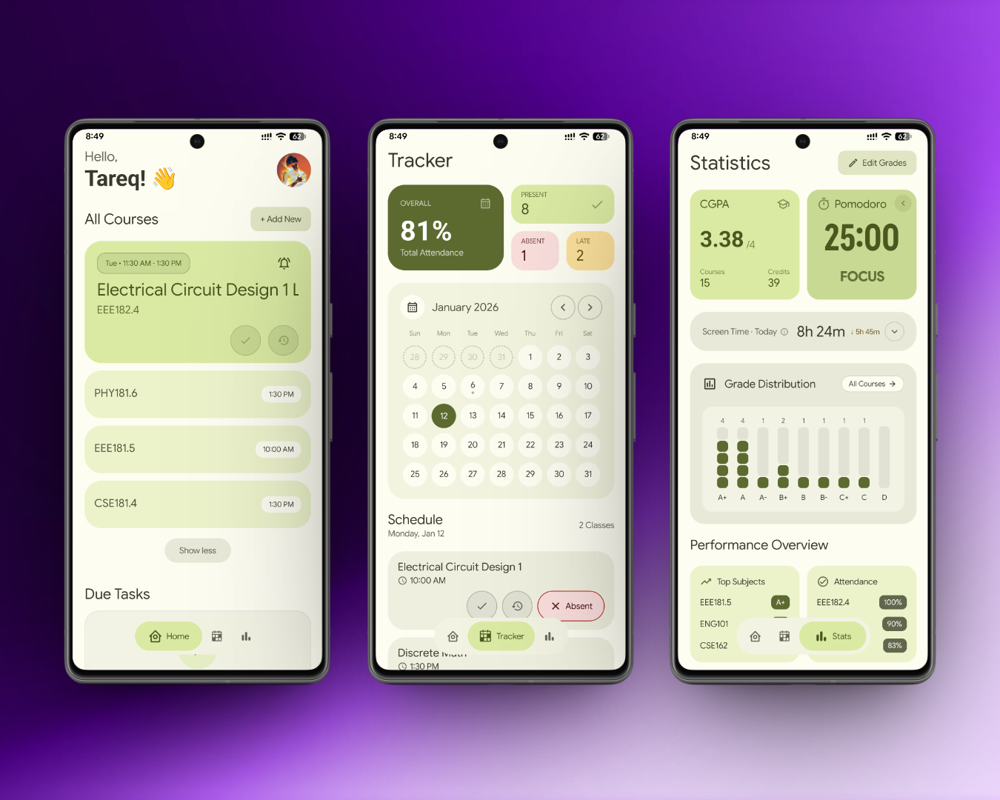

# StudyLog

StudyLog is a comprehensive Android application designed to help students manage their academic life. It represents the perfect synergy of robust functionality and sleek, modern design.

  

## Download

Get the latest version of StudyLog from the content in this repository.

## Features

*   **Course Management**: Organize your academic schedule by adding and managing courses. Keep track of course details and related materials in one place.
*   **Assignment & Note Tracking**: Create and view notes and tasks linked to specific courses. Never miss a deadline or forget an important detail.
*   **Grade Tracking**: Record your grades and monitor your academic performance over time with the Stats dashboard.
*   **Focus Timer**: Built-in Pomodoro timer to help you stay focused during study sessions. Run focus timers in the background with persistent notifications.
*   **Screen Time Tracker**: Monitor your device usage to ensure you are maintaining a healthy balance between study and leisure.
*   **Calendar Integration**: Seamlessly syncs with your device calendar to keep your schedule up to date.
*   **Smart Reminders**: Schedule exact alarm notifications to remind you of upcoming tasks and study sessions.
*   **Customizable Tweaks**: Personalize the app appearance with dynamic color palettes and theme settings.
*   **Home Screen Widgets**: Access your schedule and quick stats directly from your home screen using Glance widgets.
*   **Cloud Sync**: Secure authentication via Google Sign-In and data synchronization using Firebase.

## Installation

1.  Download the `StudyLog.apk` file from this repository.
2.  Open the file on your Android device.
3.  If prompted, allow installation from "Unknown Sources" in your device settings.
4.  Follow the on-screen instructions to install.

## Permissions

The app requires the following permissions to function correctly:

*   **Notifications**: To send reminders and timer updates.
*   **Calendar**: To read and write course schedules to your calendar.
*   **Usage Stats**: To track screen time and providing focus insights.
*   **Exact Alarms**: To ensure reminders go off at the precise scheduled time.
*   **Foreground Service**: To keep the focus timer running when the app is in the background.

## Built With

StudyLog is built using modern Android development tools and libraries:

*   **Kotlin** & **Jetpack Compose** (Material Design 3)
*   **MVVM Architecture** & **Clean Architecture**
*   **Hilt** for dependency injection
*   **Room** for local database
*   **Firebase** for backend services
*   **Jetpack Navigation Compose**
*   **Kotlin Coroutines & Flow**
*   **Coil** for image loading
*   **Jetpack Glance** for widgets
*   **Material Kolor** for dynamic theming
